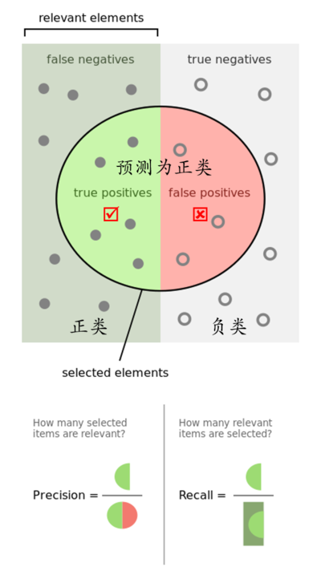
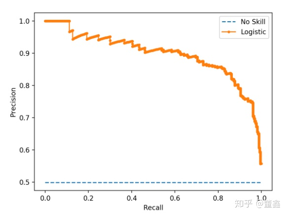

# 评估指标

## 准确率

* 分类正确的样本占总样本的比例

$$
Accuracy = \frac{n_{correct}}{n_{total}}
$$

不同类别样本比例不均衡时，占比大的类别会成为影响准确率结果的最主要因素

## 精确率和召回率

* 精确率（**Precision**）:

  分类正确的正样本个数占分类器判定为正样本的样本个数的比例
  $$
  Precision = \frac{TP}{TP+FP}
  $$

* 召回率（**Recall**）

  分类正确的正样本个数占真正正样本个数的比例
  $$
  Recall = \frac{TP}{TP+FN}
  $$
  

* P-R曲线
  + 横轴：召回率        纵轴：精确率

  + P-R曲线上点的意义：

    在某一阈值之下，模型将大于该阈值的结构判定为正样本，小于该阈值的结构判定为副样本，

    返回的结果对应的召回率和精确率

    

  + 整条P-R曲线是通过将阈值从高到低移动生成的，原点附近代表阈值最大时候的精确率和召回率

* F1-Score

  + 精确率和召回率的调和平均值：

  $$
  F1=\frac{2\times Precision\times Recall}{Precision + Recall}
  $$

  

## 平方根误差的问题

* RMSE
  $$
  RMSE=\sqrt{\frac{\sum_{i=1}^{n}(y_i-\hat{y}_i)^2}{n}}
  $$
  

常被用来衡量回归模型的好坏

* RMSE在面对离群点时性能不佳

  + 解决方案：

    1. 预处理阶段过滤掉离群点

    2. 建模时将离群点产生的机制融入

    3. 找一个更合适、鲁棒性更好的评价指标。

       如平均绝对百分比误差（Mean Absolute Percent Error）：
       $$
       MAPE = \sum_{i=1}^n\left|\frac{y_i-\hat{y}_i}{y_i}\right|\times \frac{100}{n}
       $$
       相比RMSE，MAPE相当于把每个点的误差进行了归一化，降低了离群点对绝对误差的影响

## ROC曲线

二值分类器是最常见也是应用最广泛的分类器。ROC曲线经常作为评估二值分类器最重要的指标

* Receiver Operating Characteristic Curve

  + 假阳性率：
    $$
    FPR=\frac{FP}{N}
    $$
    

  + 真阳性率：

$$
TPR=\frac{TP}{P}
$$

* ROC曲线的绘制

  1. 统计正负样本数量，假设正样本数量为P，负样本数量为N

  2. 横轴刻度设为 1/N，纵轴刻度设为1/P

  3. 根据模型输出的预测概率对样本排序（从高到低）

  4. 遍历样本，从零点开始，遇到正样本沿纵轴绘制一个刻度，

     遇到负样本沿横轴绘制一个刻度，直至（1，1）这个点

## AUC

* 指ROC曲线下面积的大小，沿着ROC曲线的横轴做积分即可

* AUC取值在0.5～1之间

  AUC越大说明分类器越有可能把真正的正样本排在前面，分类效果越好

## ROC曲线相比于P-R曲线有什么特点

* 当正负样本分布发生变化时，ROC曲线的形状能够基本保持不变

  而P-R曲线形状一般会有剧烈的变化

  + 在正负样本不均匀时，选择不同的测试集，P-R曲线的变化会很大

  + ROC曲线适应的场景更多

    但当研究者更关心模型在特定数据集上的表现时，P-R曲线则能更直观展现模型的性能

# 模型评估的方法

**Holdout检验、交叉验证、自助法**

* Holdout检验

  把样本按照 7：3的比例分割为训练集和验证集，包括绘制ROC曲线，计算精确率和召回率等指标

  + 缺点：验证集上得出的结论与最初的分组有很大关系

* 交叉检验

  k-fold交叉验证：

   	1. 将全部样本划分为k个大小相等的样本子集
   	2. 依次遍历k个子集
   	3. 每次将当前子集作为验证集，剩余子集作为训练集，进行模型的训练和评估
   	4. 最后把k次评估指标的均值作为最终的评估指标

  在实际的实验中，通常k=10

* 留一验证

  留下1个样本作为验证集，其余样本作为测试集。

  对n个样本进行遍历，进行n次验证，再求平均值得到评估指标

  样本总数多的时候，时间开销极大

  留一验证是留$p$验证的特殊情况，从n中抽取p个元素共有 $C_n^p$ 种可能，时间开销巨大，实际工程中较少应用

* 自助法

  样本规模小的时候，划分会让训练集进一步缩小

  自助法是基于自助采样法的检验方法

  1. 总数为n的样本集合，进行n次有放回的随机采样，得到大小为n的训练集

  2. n次采样中有的样本会被重复采集，有的样本没有被抽取过。

     将没有被抽取过的样本作为验证集，进行模型验证

* 自助法采样中n趋于无穷大时，最终有多少数据从未被选择过：
  $$
  \lim _{n\rightarrow\infty}\left(1-\frac{1}{n}\right)^n=\lim_{n\rightarrow\infty}\frac{1}{\left(1+\frac{1}{n-1}\right)^n}=\lim_{n\rightarrow\infty}\frac{1}{\left(1+\frac{1}{n-1}\right)^{n-1}}*\lim_{n\rightarrow\infty}\frac{1}{\left(1+\frac{1}{n-1}\right)} = \frac{1}{e} \approx0.368
  $$
  

约有 $36.8 \%$ 的样本没有被抽取过，可作为验证集

# 过拟合和欠拟合

* 过拟合：

  模型在训练集上表现良好，在测试集上表现较差的情况

* 欠拟合：

  在训练集和测试集上表现都不好的情况

## 降低过拟合风险的办法

* 获取更多的训练数据

  图像的旋转、平移等，更进一步地，使用GAN等方法来合成

* 降低模型复杂度

  神经网络减少层数、神经元个数等，决策树降低深度、进行剪枝

* 增加正则化项

* 集成学习

## 降低欠拟合风险的办法

* 添加新特征
* 增加模型复杂度
* 减小正则化系数

