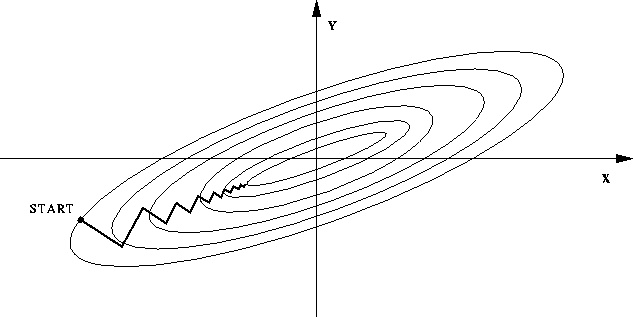
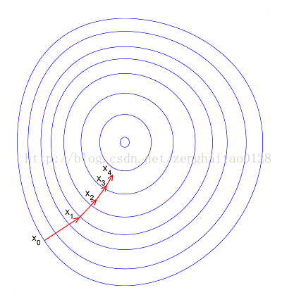

# 特征归一化

## 做特征归一化的原因

* 消除特征之间的量纲影响，使得数据指标处于同一数量级

* 归一化的目的就是使得预处理的数据被限定在一定的范围内（比如[0,1]或者[-1,1]）

  从而消除**奇异样本数据**导致的不良影响。

  + 奇异样本数据是指相对于其他输入样本特别大或特别小的样本矢量（即特征向量）

* 如果不进行归一化，那么由于特征向量中不同特征的取值相差较大，会导致目标函数变“扁”。

  这样在进行梯度下降的时候，梯度的方向就会偏离最小值的方向，走很多弯路，即训练时间过长。

* 如果进行归一化以后，目标函数会呈现比较“圆”，这样训练速度大大加快，少走很多弯路。

  

  

  ## 归一化的好处

  1. 归一化后加快了梯度下降求最优解的速度

  2. 归一化有可能提高精度（如KNN）

## 归一化的方法

* 线性归一化：
  $$
  X_{norm} = \frac{X-X_{min}}{X_{max}-X_{min}}
  $$

* 零均值归一化：
  $$
  z = \frac{x-\mu}{\sigma}
  $$

## 归一化适用范围

* 通过梯度下降法求解的模型通常是需要归一化的。如：

  线性回归、逻辑回归、SVM、神经网络等

# 文本表示模型

## 词袋模型（Bag of Words）和 N-gram 模型

* 词袋模型：

  + 将每篇文章视作一袋子词，忽略词出现的顺序。

  + 每篇文章表示成一个长向量，向量中的每一个维代表一个单词，

    该维的权重代表了这个词在原文中的重要程度。常用 **TF-IDF** 来计算权重
    $$
    TF-IDF(t,d)=TF(t,d)\times IDF(t)
    $$

    + $TF(t,d)$ ：单词 $t$ 在文档 $d$ 中出现的频率

    + $IDF(t)$ ：逆文档频率，用于衡量单词$t$对表达语义的重要性
      $$
      IDF(t) = \log\frac{文章总数}{包含单词的文章总数+1}
      $$

* N-gram：

  将连续的 $n$ （$n \leq N$）个词组成的词组（**N-gram**) 作为单独特征放到向量表示中。

## 词嵌入与深度学习模型

* 词嵌入模型：
  + 将每个词映射到低维空间（通常 $K\in(50,300)$ ）上的一个稠密向量。
  + 词向量$K$维空间的每一维可以看作是一个隐藏的主题

## Word2Vec

[详细见[Word2Vec中的数学原理详解]](https://www.cnblogs.com/peghoty/p/3857839.html)

# 图像数据不足时的处理方法

**迁移学习、生成对抗网络、图像处理、上采样技术、数据扩充**

* 模型的信息来源：
  + 训练数据中蕴含的信息
  + 模型的形成过程中，人们提供的先验信息

模型数据不足时就需要更多先验信息。

* 先验信息的使用：
  + 作用与模型上，如：采用特定的内在结构、条件假设或者添加一些约束条件
  + 作用在数据上，如：根据特定的先验假设去调整、变换或扩展训练数据

* 训练数据不足带来的问题：
  + 过拟合：训练数据上效果不错，测试集上效果不佳

* 图像数据不足时的处理方法：

  + 基于模型：

    思路：降低过拟合风险

    方法：简化模型、添加约束项缩小假设空间、集成学习、Dropout超参数等

  + 基于数据：

    思路：保持特定信息的前提下，对原始数据进行适当变换扩充数据集

    方法：

     1. 一定程度的随机旋转、平移、缩放、裁剪、填充、左右翻转等

        （对应了一个目标在不同角度的观察结果）

    	2. 对图像中的像素添加噪声扰动，如椒盐噪声，高丝白噪声等

    	3. 颜色变换。例如在RGB颜色通道上进行主成分分析，

        得到3个主成分的特征向量 $p_1,p_2,p_3$, 及其对应的特征值 $\lambda_1,\lambda_2,\lambda_3$

        在每个像素的RGB值上添加增量$[p_1,p_2,p_3]\cdot[\alpha_1\lambda_1,\alpha_2\lambda_2,\alpha_3\lambda_3]$

        其中 $\alpha_1，\alpha_2，\alpha_3$ 是均值0，方差较小的高斯分布随机数

    	4. 改变图像的亮度、清晰度、对比度、锐度等

  

  

  除了直接在图像空间进行变换外，还可以先进行特征提取，

  然后在图像的的特征空间内进行变换，利用一些通用的数据扩充或上采样技术，如SMOTE算法

  还可以使用生成模型合成一些新样本，如GAN

  此外还可以使用迁移学习，在大规模数据集上预训练好的通用模型，

  使用通用模型在针对目标任务上进行小数据集的微调（fine-tune）

